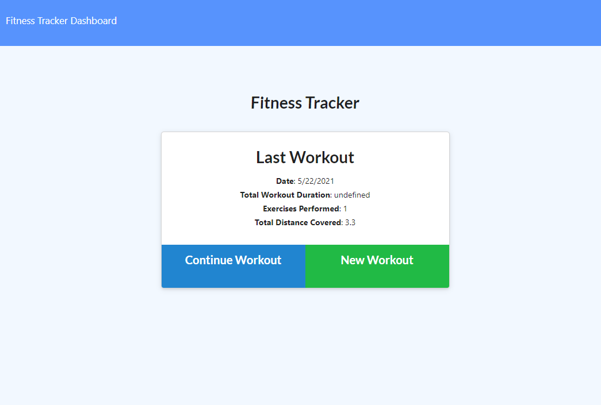
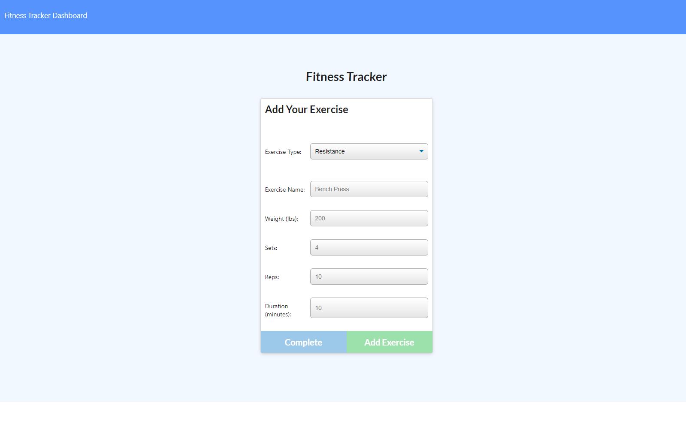

# Workout Tracker
This applicatiion allows a user to track their workouts.  Users can enter cardio or resistance exercises, tracking their reps, duration, etc.   

## Motivation
My motivation for this site is to make a site for users to easily track their workouts. In the past, I've found that creating a workout plan is the best way for me to continue working out.  This site allows me to create a cardio or resistance workout plan, which helps me to reach my goals.  

### Repository

View my [GitHub_Repository](https://github.com/joshwalters34/workout_tracker)

### Website

Visit my [Website](https://desolate-atoll-26792.herokuapp.com/)

### Images

### Technologies 
- Express 
- Javascript
- MongoDB
- Mongoose
- NPM Morgan

### Installation
To install dependencies for this application, run the following commands

        npm init -y
        npm i